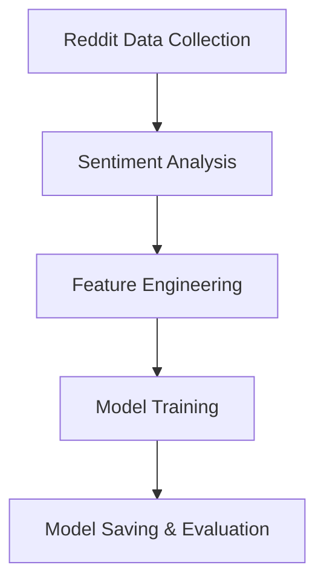

# 🪙 CryptoSense – AI-Driven Cryptocurrency Sentiment & Price Prediction

**CryptoSense** is an end-to-end machine learning project that analyzes social sentiment from Reddit discussions and cryptocurrency market prices to predict the next market move.  
The system performs data collection, sentiment analysis, feature engineering, and model training using a Random Forest Classifier for trend prediction.

---

## 🚀 Features

- 🔍 **Collects real-time Reddit data** using the PRAW (Python Reddit API Wrapper)
- 💬 **Analyzes sentiment** from posts and comments using VADER Sentiment Analyzer
- 📊 **Generates features** combining market sentiment and crypto price data
- 🤖 **Trains a Random Forest model** to predict future price direction (Up/Down)
- 💾 **Saves trained model** as `random_forest.pkl` for future predictions

---

## 🧠 Project Workflow



---

## 🧩 Tech Stack

| Component | Library |
|------------|----------|
| Data Collection | `praw`, `pandas`, `datetime`, `os` |
| Sentiment Analysis | `vaderSentiment` |
| Feature Engineering | `pandas`, `scikit-learn` |
| Machine Learning | `scikit-learn (RandomForestClassifier)` |
| Model Persistence | `joblib` |

---

## 📂 Folder Structure

```
CryptoSense/
│
├── data/
│   ├── reddit_data.csv           # Raw Reddit data
│   ├── feature_data.csv          # Final feature dataset for ML
│
├── model/
│   └── random_forest.pkl         # Trained Random Forest model
│
├── collect_data.py               # Reddit data collector
├── sentiment.py                  # Sentiment scoring script
├── features.py                   # Feature engineering and labeling
├── model.py                      # ML model training script
└── README.md                     # Project documentation
```

---

## ⚙️ Setup Instructions

### 1️⃣ Install Dependencies
```bash
pip install praw pandas scikit-learn vaderSentiment joblib
```

### 2️⃣ Reddit API Setup
Create a Reddit application at [https://www.reddit.com/prefs/apps](https://www.reddit.com/prefs/apps)  
Copy your credentials and paste them inside `collect_data.py`:

```python
reddit_keys = {
  "client_id": "YOUR_CLIENT_ID",
  "client_secret": "YOUR_CLIENT_SECRET",
  "user_agent": "CryptoSenseApp"
}
```

---

## 🧩 How to Run the Pipeline

### Step 1: Collect Reddit Data
Fetch crypto-related posts and store them locally:
```bash
python collect_data.py
```

### Step 2: Analyze Sentiment
Apply VADER sentiment scores to collected Reddit posts:
```bash
python sentiment.py
```

### Step 3: Create Features
Merge sentiment data with price data and generate training labels:
```bash
python features.py
```

### Step 4: Train the Model
Train a Random Forest classifier on sentiment and price features:
```bash
python model.py
```

After training, the model will be saved as:
```
model/random_forest.pkl
```

---

## 📊 Example Output

```
Accuracy: 0.86
Model saved to model/random_forest.pkl
```

---

## 🧮 How It Works

### 1. Data Collection (`collect_data.py`)
- Fetches cryptocurrency-related discussions using Reddit’s PRAW API.
- Saves raw posts to `data/reddit_data.csv`.

### 2. Sentiment Analysis (`sentiment.py`)
- Uses `VADER` to assign a **compound sentiment score** to each Reddit post.
- Adds a `sentiment` column to the dataset.

### 3. Feature Engineering (`features.py`)
- Merges sentiment data with **price history** (from `fetch_price_history()`).
- Aggregates sentiment and price hourly.
- Creates a binary `label` indicating if the next price increased (1) or decreased (0).
- Outputs `data/feature_data.csv`.

### 4. Model Training (`model.py`)
- Loads `feature_data.csv` into a Pandas DataFrame.
- Trains a **RandomForestClassifier (n_estimators=100)** on `sentiment` and `price`.
- Splits data into 80/20 train-test ratio.
- Saves model using `joblib`.

---

## 🧠 Algorithms & Concepts

| Concept | Description |
|----------|-------------|
| **VADER Sentiment Analysis** | Calculates polarity of Reddit text (-1 to +1) |
| **Random Forest Classifier** | Ensemble method combining 100 decision trees for classification |
| **Feature Engineering** | Combines social sentiment and price trend data |
| **Evaluation Metric** | Accuracy score on unseen test data |

---

## 🔮 Future Improvements

- Integrate **live crypto price APIs** (CoinGecko / Binance)
- Add **real-time prediction dashboard**
- Extend dataset to include **Twitter / News sentiment**
- Experiment with **LSTM or Transformer models** for sequence-based forecasting
- Visualize **sentiment vs price correlation**

---

## 👨‍💻 Author

**Srikar Katakam**  
Master’s Student in Software Engineering | AI & ML Research Enthusiast  
📧 [srikar.katakam@gmail.com](mailto:srikar.katakam@gmail.com)  
🔗 [LinkedIn](https://www.linkedin.com/in/srikar-katakam-1995ab271/) • [GitHub](https://github.com/srikar0313)

---

## 🧩 Summary

CryptoSense demonstrates how social media sentiment influences cryptocurrency price movement.  
By integrating **Reddit sentiment**, **historical prices**, and **machine learning**, it provides an explainable, data-driven approach for market behavior prediction.
